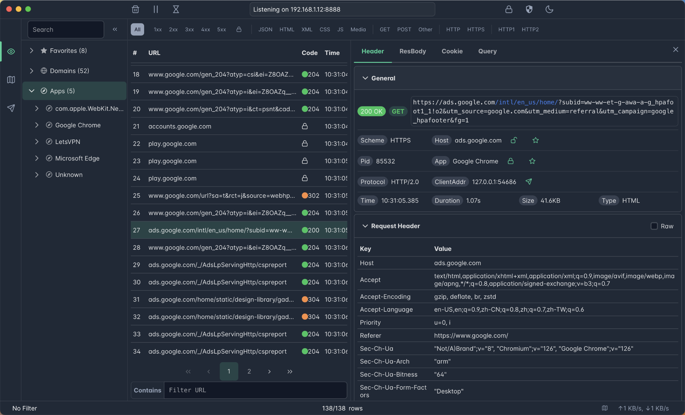
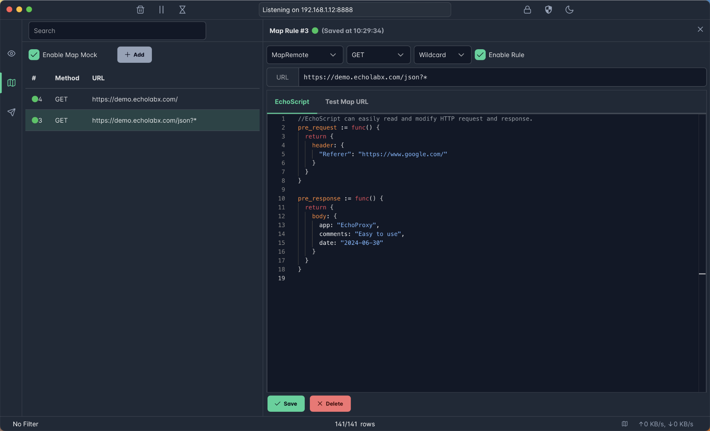

# EchoProxy - Modern API debugging Proxy with powerful Map Mock
EchoProxy is a modern API debugging proxy that offers powerful mapping and mocking capabilities. It allows developers to inspect, debug, and modify API requests and responses flowing between client applications and servers.




## Features
* 🚀 Powered by **Golang** for the high-performance network application.
* ✅ Hassle-free Intercept HTTP/HTTPS requests/response from Web Browsers, iOS, and Android devices.
* ✅ Mapping and Mocking support with EchoScript, easy to learn and use.
* ✅ Modern and intuitive UI.
* ✅ MacOS 11+, Windows 10+

## Map Mock examples

Change Request **URL** and **Method**. It can be used for mapping APIs from PROD to DEV.
```go
pre_request := func() {
  return {
    url: "http://127.0.0.1:8080/json",
    method: "GET"
  }
}
```

Change Request **Header**. It can be used for debugging other developer's API.
```go
pre_request := func() {
  return {
    header: {
      "Referer": "https://www.google.com/",
      "Accept-Encoding": "gzip"
    }
  }
}
```

Change Response **Body**. It can be used for mocking APIs for debugging and testing.
```go
pre_response := func() {
  return {
    body: {
      app: "EchoProxy",
      comments: "Easy to use",
      date: "2024-06-30" 
    }
  }
}
```

The script changes request and response is named **EchoScript**. It is easy to learn and use.

## Download
Comming soon.
